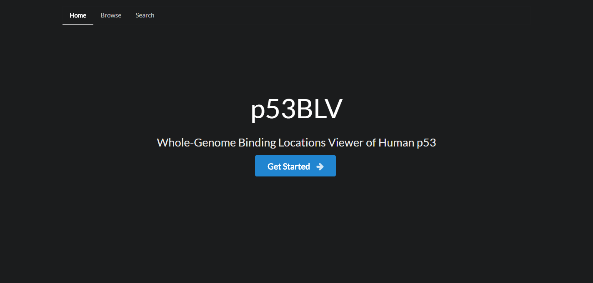
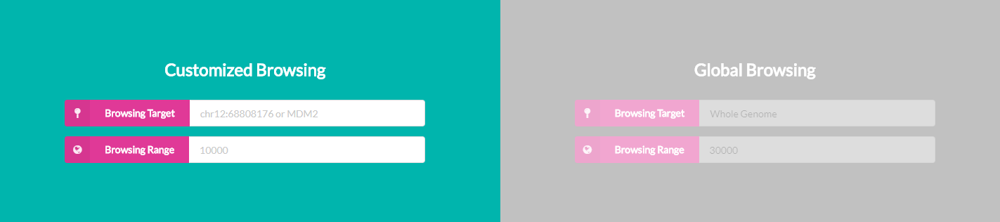
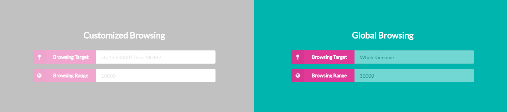
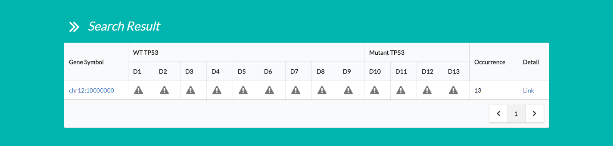
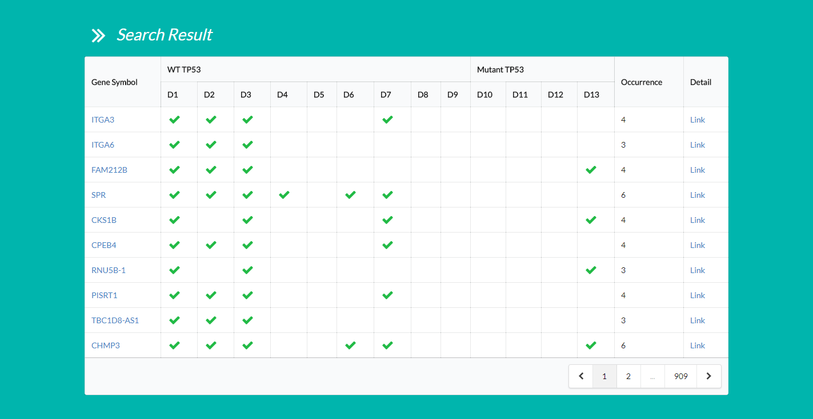
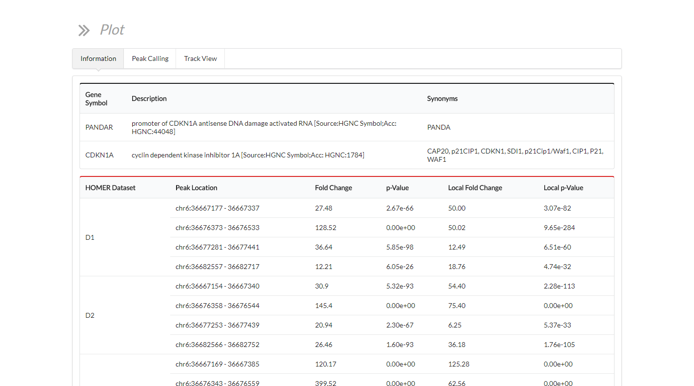
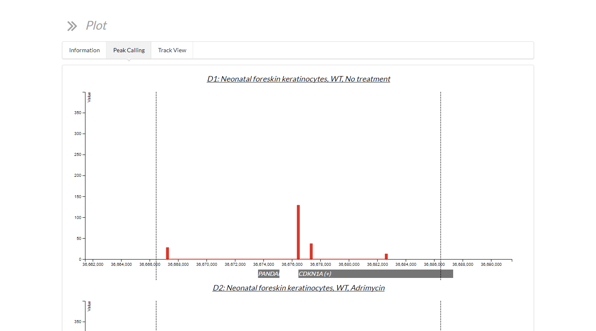
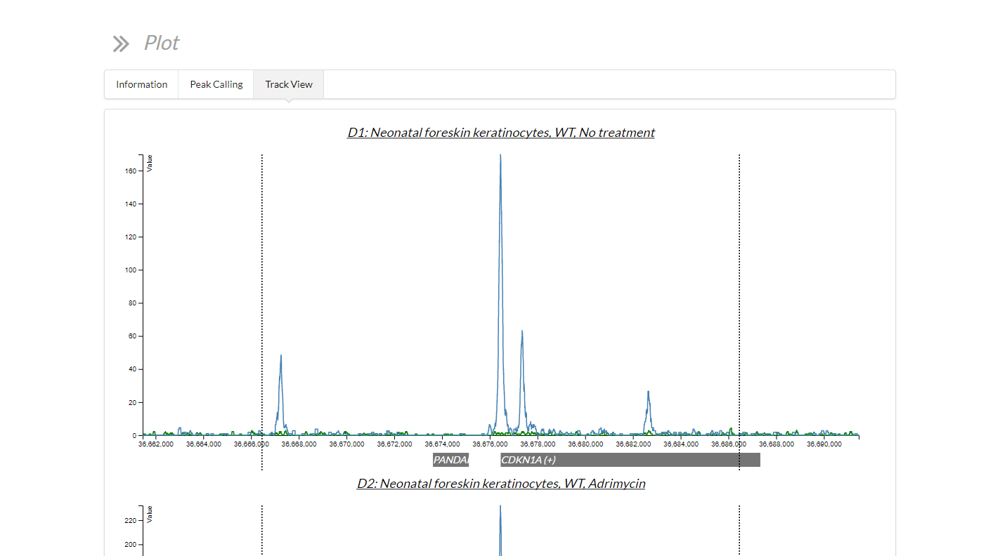

# p53BLV

> Whole-Genome Binding Locations Viewer of Human p53

## Install

```bash
$ npm i

# or

$ yarn
```

## Config

```bash
$ cp option.sample.json option.json

# fill in all information in the configuration file
$ vi option.json
```

## Start

```bash
$ npm start

# or

$ yarn start
```

## Workflow

1. Landing page



2. Choosing the browsing mode

_Customized browsing_



_Global browsing_



3. Setting conditions for searching


4. Showing search results

_Customized browsing_



_Global browsing_



5. Showing details and plotting

_Information_



_Peak calling_



_Track view_


